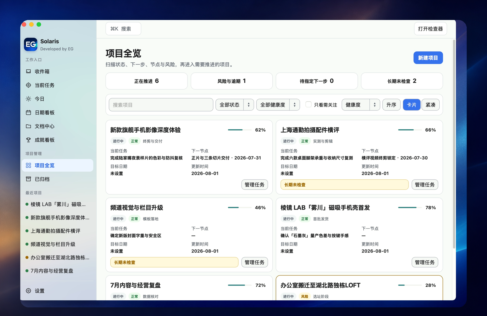
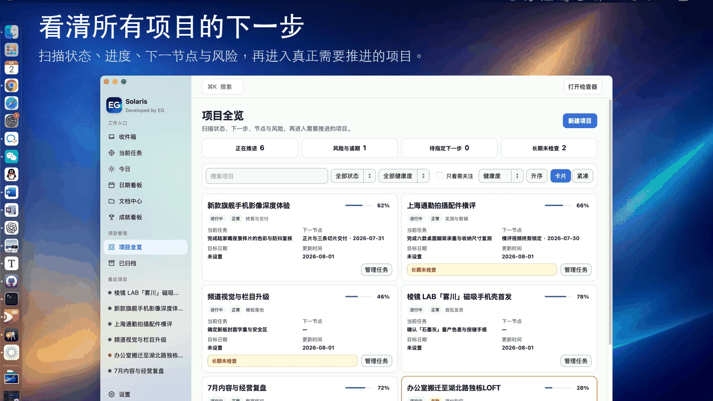
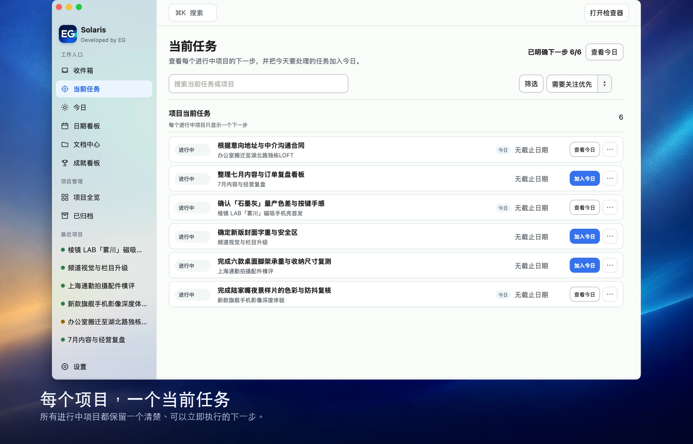
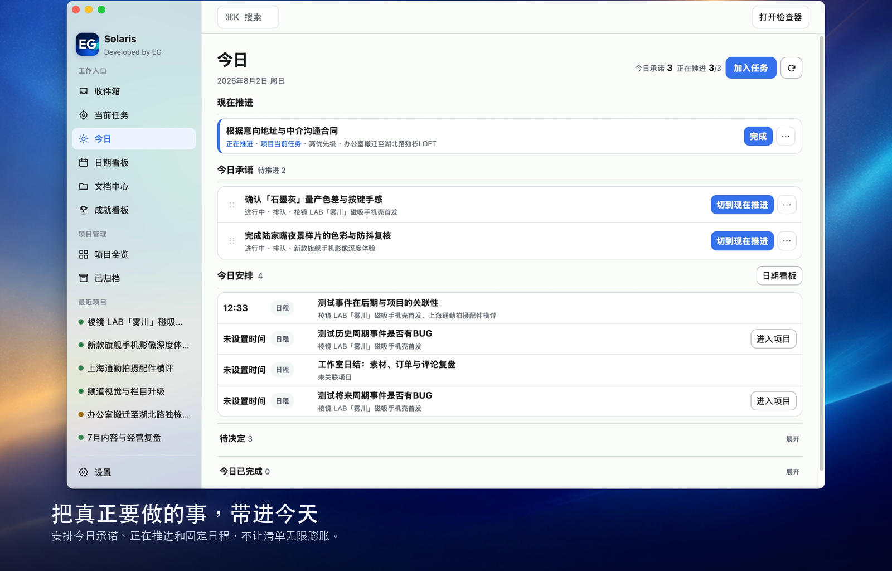
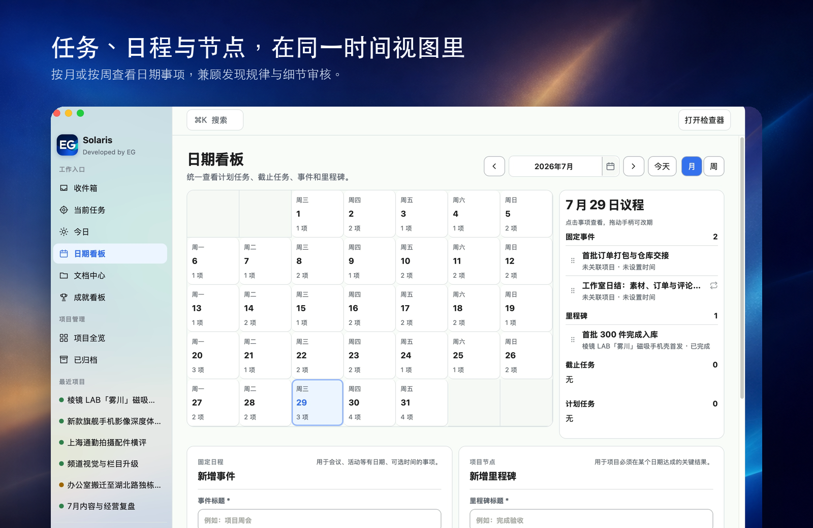
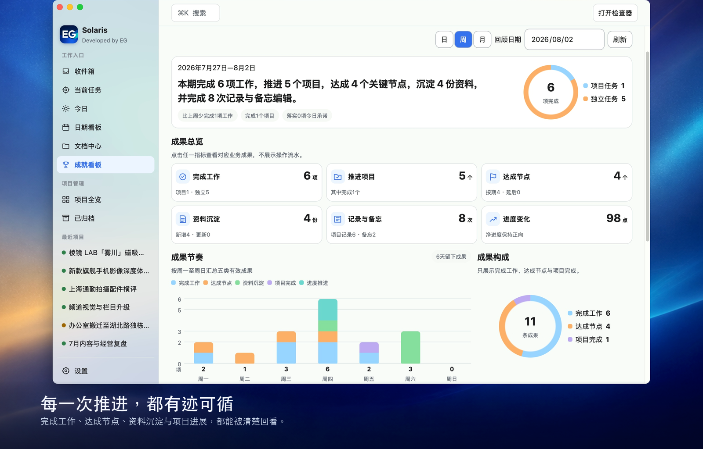

<p align="center">
</p>
<h1 align="center">Solaris</h1>

<p align="center"><strong>把多个项目，收束成今天真正要推进的下一步。</strong></p>

<p align="center">
  本地优先的 macOS 个人项目指挥台。<br>
  一个项目，一个当前任务；每一次推进与成果，都留在你自己的 Mac 上。
</p>

<p align="center">
  <a href="https://github.com/EricGuo3/solaris-releases/releases/latest"><strong>下载最新版</strong></a>
  ·
  <a href="docs/USER_GUIDE.md">查看用户指南</a>
  ·
  <a href="https://github.com/EricGuo3/solaris-releases/issues/new/choose">反馈与建议</a>
</p>

<p align="center">
  <sub>macOS 15.7+　·　Apple Silicon　·　Developer ID 签名与 Apple 公证　·　免费使用</sub>
</p>



## 不是更多清单，而是清楚的下一步

Solaris 围绕一个简单原则工作：**每个进行中的项目，始终只有一件当前任务。**

你可以保留完整的任务清单，但此刻不必同时盯住所有事情。完成当前任务后，再指定下一步，让项目持续向前，而不是停在“之后再想”。

<table>
  <tr>
    <td width="33%" valign="top">
      <strong>看清全局</strong><br><br>
      在项目全览中扫描状态、进度、下一步、关键节点与风险。
    </td>
    <td width="33%" valign="top">
      <strong>聚焦今天</strong><br><br>
      只把真正准备推进的事项加入今日，给变化留下空间。
    </td>
    <td width="33%" valign="top">
      <strong>看见成果</strong><br><br>
      完成工作、达成节点和资料沉淀，都会成为可回看的进展。
    </td>
  </tr>
</table>

## 从所有项目，到今天真正要做的事



## 核心体验









## 所有工作，都能回到项目

任务、事件、里程碑、记录、备忘和文档都可以围绕项目整理：

- 临时事项先放进收件箱，不打断正在进行的工作；
- 在“今日”中安排真正准备完成的事项；
- 在日期看板中统一查看任务日期、事件和里程碑；
- 把方案、决定、过程结论和重要文件留在对应项目；
- 项目完成后归档，历史任务与成果仍可查找和回顾。

## v1.3.1 新增

- **新增日期涂色标记**：可在日期看板中使用浅红、浅蓝或双色标记日期，设置会持久保存并纳入备份恢复；
- **归档备忘支持删除与恢复**：已归档备忘可移入“最近删除”，并可复原，相关任务与项目关系保持不变；
- **项目记录工作台更顺畅**：优化大纲视图定位与预览滚动，增加项目记录正文输入空间，完善工作台体验；
- **项目详情信息更聚焦**：优化任务、里程碑、事件、最近资源、重要文档和检查器的展示与操作；
- **Bug 修复与体验优化**：集中修复并优化日期看板、项目详情、当前任务、文档中心和主题的交互与体验。

完整变化请查看 [Solaris v1.3.1 发布说明](docs/releases/RELEASE_NOTES_v1.3.1.md)。

## 本地优先，数据由你掌控


- 无需注册账户；
- 不包含广告、用户行为分析或遥测；
- 不会主动上传工作区、诊断记录或使用行为；
- 工作数据保存在你选择的本地工作区；
- 支持应用内部备份和工作区 ZIP 导出。


完整说明请阅读 [Solaris 隐私说明](docs/PRIVACY.md)。

## 适合什么样的工作

Solaris 适合：

- 同时推进多个个人或工作项目；
- 经常面对很多事项，却不确定此刻先做什么；
- 希望任务、事件、记录和资料围绕项目集中整理；
- 能够盘点个人成就，持续给予正向激励；
- 重视本地保存和数据隐私的 macOS 用户。


## 下载与安装


系统要求：

- macOS 15.7 或更高版本；
- Apple Silicon 处理器。

[前往最新版下载页面](https://github.com/EricGuo3/solaris-releases/releases/latest)，下载 `Solaris v1.3.1`：

1. 打开下载的 DMG；
2. 将 Solaris 拖入“应用程序”文件夹；
3. 从“应用程序”文件夹启动 Solaris。

安装包已经过 Developer ID 签名和 Apple 公证。

<details>
<summary>验证 DMG 的 SHA-256</summary>

Solaris v1.3.1 DMG：

```text
85142be104a0d102a3c6b9427b3dc4c2b2ea1f7fb80f82890b75fe43f3bf11a2
```

下载后在终端执行：

```bash
shasum -a 256 Solaris_1.3.1_arm64.dmg
```

输出应与上面的 SHA-256 完全一致。

</details>

## 使用帮助与反馈

- 第一次使用：阅读 [Solaris 用户指南](docs/USER_GUIDE.md)；
- 发现可复现问题：[提交 Bug 反馈](https://github.com/EricGuo3/solaris-releases/issues/new?template=bug_report.yml)；
- 有使用场景或改进想法：[提出功能建议](https://github.com/EricGuo3/solaris-releases/issues/new?template=feature_request.yml)；
- 下载历史版本：查看 [Releases](https://github.com/EricGuo3/solaris-releases/releases)。


## 免费使用，但不是开源软件

Solaris 允许个人和组织免费下载并在个人、工作及商业场景中内部使用。

Solaris 不是开源软件。本仓库只提供正式安装包、用户文档和反馈入口，不提供应用源代码，也不授权第三方转售、公开重新分发或发布修改版本。

完整条款请阅读 [Solaris 软件使用许可](LICENSE.md)。
